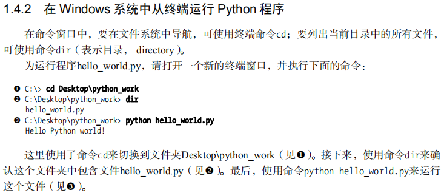

# 1 Anaconda
## 1.1 卸载Anaconda
  
对于anaconda3 ，直接运行其安装目录下的 Uninstall-Anaconda3.exe

## 1.2 设置环境变量
[Anaconda安装以及配置环境变量](https://zhuanlan.zhihu.com/p/358641541)

## 1.3 Anaconda命令
1. **创建虚拟环境**：conda create -n **name python=3.8**(或conda create -name **name python=3.8**)
     其中**name**为虚拟变量的名称，**python=3.8**为python版本，若不写，则默认为最新版本

2. **创建虚拟环境**（非默认文件夹）：conda create --prefix **路径\env** python=3.8（路径\env表示在路径下创建一个名字为env的虚拟环境；python=3.8为python版本）
    > 注意：  此时conda将不能使用-n的命令对环境进行操作，而每次操作时必须使用--prefix指定环境，详见[Managing environments](https://docs.conda.io/projects/conda/en/latest/user-guide/tasks/manage-environments.html#specifying-a-location-for-an-environment)

3. 卸载虚拟环境
    - conda remove -n **name** --all
    - conda remove --prefix 路径 -all
4. 查看虚拟环境列表：conda env list
5. 切换虚拟环境：activate name（name为环境名称）
6. （在某虚拟环境中）安装第三方包：conda install numpy或pip install numpy
7. （在某虚拟环境中）卸载第三方包：conda remove numpy或pip install numpy
8. （在某虚拟环境中）更新第三方包：conda updata numpy
9. （在某虚拟环境中）查看虚拟环境中包的信息：conda list
10. 检查更新当前conda：conda update conda
11. [conda常用命令](https://blog.csdn.net/zhayushui/article/details/80433768?ops_request_misc=%257B%2522request%255Fid%2522%253A%2522163411268116780265417082%2522%252C%2522scm%2522%253A%252220140713.130102334.pc%255Fall.%2522%257D&request_id=163411268116780265417082&biz_id=0&utm_medium=distribute.pc_search_result.none-task-blog-2~all~first_rank_ecpm_v1~rank_v31_ecpm-1-80433768.pc_search_result_cache&utm_term=conda%E6%9B%B4%E6%96%B0%E5%91%BD%E4%BB%A4&spm=1018.2226.3001.4187)

# 2 Jupyter notebook

Jupyter Notebook是基于网页的用于交互计算的应用程序。其可被应用于全过程计算：开发、文档编写、运行代码和展示结果。——Jupyter Notebook官方介绍

[Jupyter Notebook介绍、安装及使用教程](https://www.jianshu.com/p/91365f343585/)

 关于在Jupyter Notebook中切换anaconda虚拟环境，需要做到一下两点：
     1. 在环境中安装nb_conda（直接在终端运行conda install nb_conda，不需要进入到特定环境）
     2. 在特定环境中安装Jupyter Notebook（只有在某个特点环境中安装了Jupyter Notebook，则在Jupyter Notebook界面中中才可以切换，否则没有该虚拟环境）
     3. 参考：上述连接、[Jupyter Notebook切换conda虚拟环境](https://blog.csdn.net/IT_xiao_bai/article/details/102765922?utm_medium=distribute.pc_relevant.none-task-blog-BlogCommendFromMachineLearnPai2-2.channel_param&depth_1-utm_source=distribute.pc_relevant.none-task-blog-BlogCommendFromMachineLearnPai2-2.channel_param)

VSCode打开Jupyter notebook:[Working with Jupyter Notebooks in Visual Studio Code](https://code.visualstudio.com/docs/datascience/jupyter-notebooks)
# 3 Pycharm

python在笔记本中的位置（可能）：c:\users\administrator\appdata\local\programs\python\python36-32\lib\site-packages

[Pycharm 常用快捷键大全](https://mp.weixin.qq.com/s/k8_QVjPUYi0S19TVynmyZg);

# 4 从终端运行Python程序

